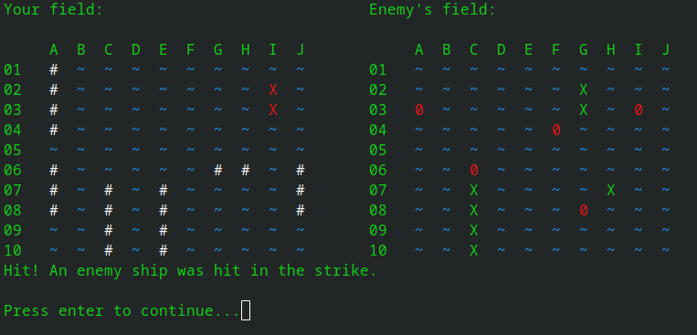

# CBattleships

My own implementation of the classic game Battleships, written in C.

### Gameplay

It plays like normal Battleships and is designed for 2 players on the same computer, taking turns.

At the start you choose the size of the playing field, anywhere from 6 to 26. Ships are then randomly spawned on both fields — the number of ships scales with the field size. Ships never touch each other side by side, but they are allowed to touch diagonally.

When a player takes their turn, their own ships are visible and they also see the battle map of the enemy field, where they can see the results of their previous shots. Between turns the screen is cleared so the other player cannot see the opponent's ships.

When prompted for coordinates, enter the longitude first and then the latitude, in the format `LetterNumber` — for example: A1, B13, C20 ...

The first player to hit every enemy ship square wins.

### Map symbols

#### Friendly field
- **X** --> hit ship
- **\#** --> ship still alive
- **~** --> sea

#### Enemy field
- **X** --> hit ship
- **0** --> missed shot
- **~** --> sea

### About

I decided to rewrite this game in C, based on a university assignment I originally misinterpreted. My interpretation turned out better than the actual assignment, but the code was written in a rush with no time, so I wanted to clean it up — and I ended up redesigning everything, this time in C instead of C++.

This project helped me stay in shape with my C knowledge and taught me a few more C quirks along the way. I'm satisfied with the outcome, and it was significantly easier than [CTetris](https://github.com/AnzeSinigoj/CTetris).

### Game screenshot

